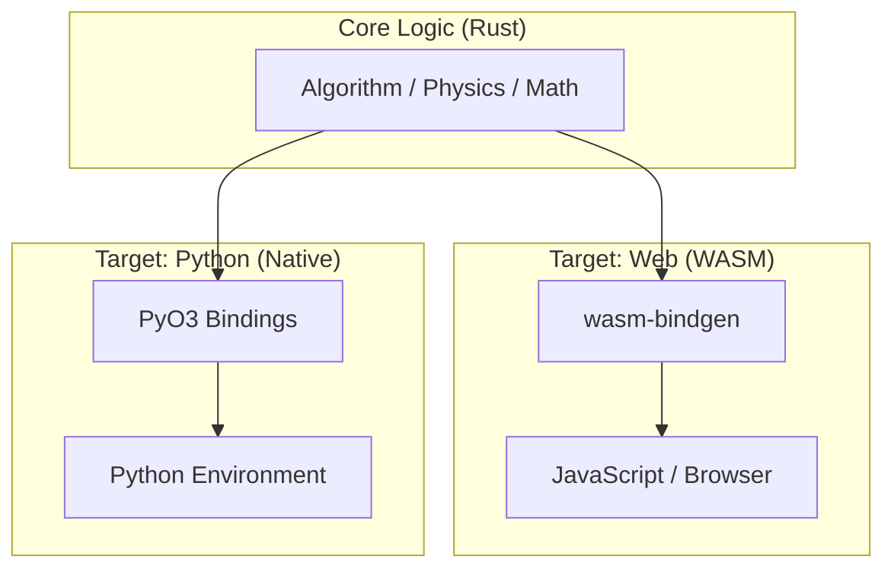

# Nexus Compute RS: Dual-Runtime R&D Architecture


**Nexus Compute RS** is a rigorous proof-of-concept template designed for R&D in Physical AI and Robotics. It implements a "Write Once, Run Everywhere" strategy for high-performance algorithms, bridging the gap between web-based visualization/sharing and Python-based rigorous analysis/backend processing.

## 1. Architectural Philosophy

In modern R&D, we often face a dilemma:
* **Python** is required for data analysis, ML integration (PyTorch), and ROS2 interfacing.
* **Web (JavaScript)** is required for easy sharing, visualization, and zero-setup demos.
* **Performance** is critical for SLAM, Optimization, and Simulation.

This project solves this by implementing the core logic in **Rust**, which is then compiled into two distinct targets via Feature Flags:



## 2. Project Structure

```text
nx-compute-rs/
├── .github/workflows/   # CI/CD for automatic WASM deployment & Python testing
├── src/
│   └── lib.rs           # The SINGLE source of truth. Contains core logic + bindings.
├── www/                 # The Web Frontend (HTML/JS)
│   ├── index.html
│   ├── index.js
│   └── pkg/             # Generated WASM artifacts (by CI)
├── Cargo.toml           # Rust configuration (defines 'wasm' and 'python' features)
├── pyproject.toml       # Python build configuration (Maturin)
└── README.md            # This document
```

## 3. Usage Guide

### A. As a Python Library (For Analysis/Backend)

You can use the Rust core as a native Python extension. This provides near-C++ performance within your Python scripts.

**Prerequisites:**
* Rust toolchain (`rustup`)
* Python 3.8+
* `pip install maturin`

**Setup & Run:**
```bash
# 1. Build and install into current venv
maturin develop --release --features python

# 2. Run in Python
python -c "import nx_compute_rs; print(nx_compute_rs.compute_metrics(10000000, 1.5))"
# python -c "import numpy as np; i = np.arange(10000000); x = i * np.pi / 180.0 * 1.5; print(np.sum(np.sin(x) * np.cos(x)))"
# python -m timeit -s "import nx_compute_rs" "nx_compute_rs.compute_metrics(10000000, 1.5)"
# python -m timeit -s "import numpy as np" "i = np.arange(10000000); x = i * np.pi / 180.0 * 1.5; np.sum(np.sin(x) * np.cos(x))"
```

## Optional: Paralell vs Serial vs NumPy
```bash
python -c "
import nx_compute_rs
import numpy as np
import timeit

# 1. Rust Serial (直列)
t_serial = timeit.timeit(
    'nx_compute_rs.compute_metrics(10000000, 1.5, False)', 
    setup='import nx_compute_rs', 
    number=10
)

# 2. Rust Parallel (並列)
t_parallel = timeit.timeit(
    'nx_compute_rs.compute_metrics(10000000, 1.5, True)', 
    setup='import nx_compute_rs', 
    number=10
)

# 3. NumPy (ベクトル化)
t_numpy = timeit.timeit(
    'x = np.arange(10000000) * np.pi / 180.0 * 1.5; np.sum(np.sin(x) * np.cos(x))', 
    setup='import numpy as np', 
    number=10
)

print(f'Rust (Serial):   {t_serial/10*1000:.2f} ms')
print(f'Rust (Parallel): {t_parallel/10*1000:.2f} ms')
print(f'NumPy:           {t_numpy/10*1000:.2f} ms')
"
```

### B. As a Web Application (For Demo/Sharing)

You can run the same logic in the browser via WebAssembly.

**Prerequisites:**
* `wasm-pack` (`curl https://rustwasm.github.io/wasm-pack/installer/init.sh -sSf | sh`)

**Setup & Run:**
```bash
# 1. Build WASM blob
wasm-pack build --target web --out-dir www/pkg --no-default-features --features wasm

# 2. Serve locally (using Python's http server for simplicity)
cd www
python3 -m http.server 8000
# Open http://localhost:8000
```

## 4. Technical Details

### Feature Flags Strategy
We use `Cargo.toml` features to minimize binary size and dependencies.
* **`features = ["wasm"]`**: Includes `wasm-bindgen`. Generates `.wasm` binary. Panics happen in JS console.
* **`features = ["python"]`**: Includes `pyo3`. Generates `.so/.pyd` shared library. Python exception handling enabled.

### Performance Considerations
* **Zero-Cost Abstraction:** Rust's iterators and logic compile down to optimized machine code (simd instructions where applicable) for Python, and optimized bytecode for WASM.
* **Memory Safety:** No manual memory management (malloc/free) required, preventing segfaults in Python extensions.
* **GIL (Global Interpreter Lock):** The Rust code runs outside Python's GIL. For multi-threaded logic, Rust can utilize all CPU cores while Python is blocked, offering true parallelism.

## 5. Deployment

This repository uses **GitHub Actions** to automatically deploy the Web version.
1.  Push to `main`.
2.  Action triggers: Compiles Rust to WASM.
3.  Deploys `www/` folder to **GitHub Pages**.

## 6. Future Roadmap

* **GPU Acceleration:** Integrate `wgpu` for portable GPU compute shaders (WebGPU + Vulkan/Metal).
* **Serialization:** Add `serde` support to pass complex JSON/Structs between JS/Python and Rust.
* **Sim2Real:** Port the Python bindings directly to a ROS2 node.

---
*Author: Funmatu*
